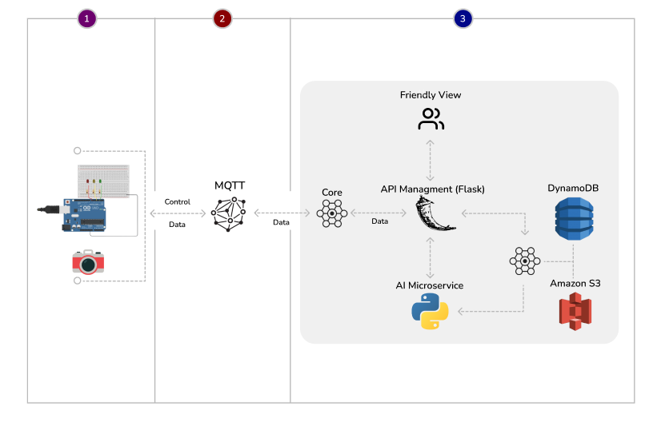

# Smart Traffic Lights (Semáforos Inteligentes)

**Autores**: Gustavo Jose Rosa, Thiago Cirne Arndt, Thomas Taiga Martinez Nakagawa  
**Professores**: Claudinei Dias, Luiz Camargo, Paulo Manseira

## Introdução

Os **Semáforos Inteligentes** representam uma evolução na gestão do tráfego urbano. Equipados com câmeras e sensores de alta tecnologia, esses dispositivos monitoram em tempo real o fluxo de veículos e capturam infrações de trânsito, como ultrapassagem de sinais vermelhos. Através da análise desses dados, uma Inteligência Artificial (IA) ajusta dinamicamente o tempo dos semáforos, otimizando a fluidez do trânsito e contribuindo para a redução de congestionamentos e do impacto ambiental.

## Funcionalidades Requisitos Funcionais e Não Funcionais

### Requisitos Funcionais (RF)

1. **Foto**: O sistema deve tirar a foto dos veículos para o calculo.

2. **Cálculo**: A IA deve calcular o tempo de acordo com movimentação dos veículos.

3. **Mudança de Sinal**: O semáforo deve mudar de sinal ao calcular o tempo com IA.

### Requisitos Não Funcionais (RNF)

1. **Desempenho**: O sistema deve processar e responder às mudanças no tráfego em tempo real, com baixa latência.

2. **Confiabilidade**: A comunicação entre os dispositivos deve ser estável e eficiente, utilizando o protocolo MQTT para garantir confiabilidade em redes de baixa largura de banda.

3. **Segurança**: Os dados em trânsito e em repouso devem ser criptografados com TLS e AES-256.

4. **Escalabilidade**: O sistema deve ser escalável para suportar um número crescente de semáforos e áreas monitoradas, com armazenamento e processamento distribuídos na nuvem (AWS).

5. **Interoperabilidade**: O sistema deve suportar múltiplos protocolos de comunicação, como MQTT, HTTP/HTTPS, CoAP e WebSockets, para facilitar a integração com diferentes infraestruturas.

6. **Usabilidade**: A interface dos dashboards deve ser fácil de usar, permitindo que os operadores de tráfego ajustem os semáforos com facilidade.

7. **Privacidade**: Deve haver controle rigoroso de acesso aos dados por meio de um sistema de Gerenciamento de Identidade e Acesso (IAM).

8. **Manutenibilidade**: O sistema deve ser modular, permitindo atualizações e manutenção dos componentes sem interromper seu funcionamento.

9. **Disponibilidade**: O sistema deve ter alta disponibilidade, utilizando redundância de servidores e sistemas de failover na nuvem para garantir que os serviços estejam sempre acessíveis.

10. **Monitoramento de tráfego em tempo real**: O sistema deve capturar e processar informações de tráfego em tempo real por meio de câmeras e sensores.
   
11. **Ajuste dinâmico de semáforos**: A Inteligência Artificial (IA) deve ajustar automaticamente o tempo dos semáforos com base no fluxo de veículos.

12. **Detecção de infrações de trânsito**: O sistema deve detectar infrações como a ultrapassagem de sinais vermelhos.

13. **Envio de dados à nuvem**: Os dispositivos de borda devem processar os dados localmente e enviar informações relevantes para a nuvem.

14. **Integração com infraestrutura urbana**: O sistema deve se integrar com outras infraestruturas urbanas por meio de APIs RESTful.

15. **Interface para operadores**: Deve existir uma interface interativa (dashboard) para os operadores monitorarem o tráfego e ajustarem manualmente os semáforos.

16. **Relatórios e análises**: O sistema deve gerar relatórios em formatos como PDF e CSV com base nos dados coletados.

17. **Armazenamento de dados**: O sistema deve armazenar dados de tráfego estruturados no DynamoDB e imagens no S3.

18. **Processamento em tempo real na nuvem**: Funções na nuvem devem ser executadas em tempo real para otimizar o tráfego.

## Arquitetura do Sistema

A arquitetura do sistema é baseada em **IoT (Internet of Things)**, combinando sensores, câmeras e algoritmos de IA para otimização do tráfego. Os dados são processados localmente e transmitidos para uma plataforma na nuvem, onde são analisados para a tomada de decisões em tempo real.

### 1. Dispositivos de Borda (Edge Devices)

- **Sensores e Câmeras**: Instalados nos semáforos e ao longo das vias, capturam informações sobre o número de veículos, velocidade e infrações de trânsito.
- **Unidades de Processamento Local**: Microcontroladores, como o **Arduino**, processam os dados capturados, enviando apenas informações relevantes para a nuvem.

### 2. Camada de Conectividade

- **Protocolo de Comunicação**: O sistema utiliza **MQTT**, um protocolo eficiente para redes de baixa largura de banda e alta confiabilidade.
- **Redes de Comunicação**: A conectividade é feita via redes **4G/5G** e, se disponível, **Wi-Fi**.

### 3. Nuvem (Cloud)

- **Plataforma IoT**: Os dados de tráfego são enviados para a plataforma de IoT via **MQTT**. Utilizamos **Python** para desenvolver soluções de processamento em tempo real e machine learning.
- **Armazenamento de Dados**: Os dados são armazenados no **Amazon DynamoDB** para dados estruturados e no **Amazon S3** para imagens.
- **Processamento em Tempo Real**: Utilizamos **AWS Lambda** para executar funções e realizar ajustes dinâmicos nos semáforos em resposta ao tráfego.

### 4. Camada de Aplicação

- **Painéis de Controle (Dashboards)**: Desenvolvidos com o **Dash (Python)**, fornecem uma interface interativa para monitorar o fluxo de tráfego e ajustar os semáforos em tempo real.
- **Relatórios e Análises**: Relatórios gerados com base nos dados coletados serão exportados em formatos como PDF ou CSV.

### 5. Segurança e Privacidade

- **Criptografia de Dados**: Utilizamos **TLS** para garantir a segurança dos dados em trânsito e em repouso, com algoritmos como **AES-256**.
- **Gerenciamento de Identidade e Acesso (IAM)**: Controle de acesso rígido para garantir que apenas usuários autorizados acessem os dados.

### 6. Integração com Infraestruturas Existentes

- **APIs RESTful**: O sistema permite integração com outras infraestruturas urbanas inteligentes por meio de APIs, facilitando a interoperabilidade.
- **Protocolos de Comunicação Compatíveis**: Além de **MQTT**, o sistema suporta **HTTP/HTTPS**, **CoAP** e **WebSockets**.

### 7. Feedback em Tempo Real

- **Atuadores Inteligentes**: Os semáforos ajustam automaticamente os tempos com base nos dados recebidos, garantindo resposta imediata às condições de tráfego.
- **Comando Manual**: Os operadores de tráfego podem ajustar manualmente os semáforos por meio de uma interface amigável desenvolvida em **Dash**.

## Objetivos do Projeto

- Otimizar o tempo de deslocamento e reduzir congestionamentos.
- Aumentar a segurança nas vias monitorando infrações de trânsito.
- Fornecer uma solução escalável e eficiente para a gestão do tráfego urbano, com suporte para integração com infraestruturas inteligentes.
- Reduzir o impacto ambiental causado por engarrafamentos, contribuindo para uma mobilidade urbana mais sustentável.

## Tecnologias Principais

- **Arduino** para processamento local.
- **MQTT** como protocolo de comunicação.
- **Python** para processamento de dados e machine learning.
- **AWS** (DynamoDB, S3, Lambda) para armazenamento e análise na nuvem.
- **Dash** para desenvolvimento de dashboards interativos.
- 

## Projeto Tinker 

- https://www.tinkercad.com/things/42ysciXCpOJ-semaforo-inteligente/editel

## Licença

Este projeto está licenciado sob os termos da licença MIT. Veja o arquivo [LICENSE](./LICENSE) para mais detalhes.
